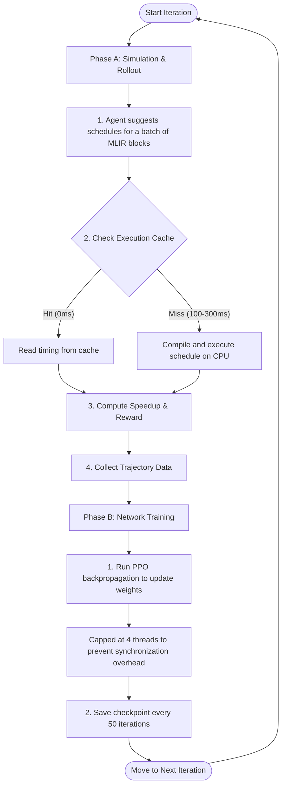

# Understanding the MLIR-RL Training Process

This document provides a detailed, end-to-end explanation of the reinforcement learning training process for the MLIR loop nest auto-scheduler. It explains the relationship between simulation (scheduling) and network training, how caching works, and how CPU/memory resource allocations are utilized.

---

## 1. High-Level Overview: The RL Loop

In this project, our goal is to automatically find the fastest compilation schedules (such as loop tiling, loop interchange, and vectorization) for MLIR operations. 

Since the search space of possible schedules is too large for exhaustive search, we use a **Reinforcement Learning (RL)** agent. The agent learns by **trial and error**, alternating between two major phases:



---

## 2. Phase A: Simulation, Evaluation, and Trajectory Collection

During this phase, the agent interacts with the environment to collect data. This is called a **rollout** or **trajectory collection**.

### Step 1: Suggesting Schedules
The agent's policy network receives the structural features of an MLIR loop nest (like loop bounds, number of loads/stores, dimensions) and suggests an optimization step (e.g., *Interchange loop 1 with loop 2* or *Tile loop 1 with factor 8*).

### Step 2: Evaluating the Schedule (Why We Must Run It)
To train the agent, we must compute a **Reward**. The reward is based on the **speedup** of the scheduled code compared to the unoptimized baseline:
$$\text{Speedup} = \frac{\text{Baseline Execution Time}}{\text{Scheduled Execution Time}}$$

The only way to get the exact execution time is to:
1. Translate the scheduled MLIR loop nest into LLVM IR.
2. Compile it using the LLVM JIT compiler (Execution Engine).
3. Execute the JIT-compiled binary on the CPU node.
4. Measure the exact JIT execution runtime in nanoseconds.

### Step 3: How the Execution Cache Saves Time
Compiling and running MLIR code takes **100ms to 300ms** per execution. Doing this thousands of times makes training very slow. To optimize this, we use a persistent **Execution Cache** (`exec_data.json`):
* **Cache Hit:** If the agent suggests a schedule it has tried before, we lookup the runtime from the cache instantly (**0ms**).
* **Cache Miss:** If the schedule is new, we must perform JIT compilation and execution (**100–300ms**).

### Step 4: Speeding Up Cache Misses via Parallelism
When a batch of benchmarks yields multiple cache misses, we evaluate them in parallel.
* **Without Parallelism (Sequential):** If there are 10 cache misses, the main thread compiles and runs them one-by-one, taking ~2 seconds.
* **With Parallelism (`ThreadPoolExecutor`):** If we allocate multiple CPU cores (e.g., 28 cores), the `ThreadPoolExecutor` runs all 10 cache-miss compilations at the same time on different cores, reducing the total time to ~0.2 seconds.

---

## 3. Phase B: Neural Network Training (PPO Update)

Once the agent completes a rollout (e.g., collecting 64 trajectory steps of schedules and their rewards), the simulation stops, and network training begins.

### Step 1: PPO & Value Network Updates
The trajectory data (observations, actions taken, and rewards received) is fed into the policy and value networks. We run the **Proximal Policy Optimization (PPO)** algorithm to adjust the neural network weights:
* Actions that led to high speedups (positive rewards) are reinforced (made more likely in the future).
* Actions that caused slowdowns or timeouts (negative rewards) are penalized (made less likely).

### Step 2: Why PyTorch is Capped at 4 Threads
During this weight-update phase, we run tensor mathematics (forward passes, loss calculation, backpropagation) in PyTorch. 
* In `train.py`, we explicitly configure:
  ```python
  torch.set_num_threads(4)
  ```
* **The Reason:** Because our policy and value networks are very small (e.g. standard LSTMs or small Transformers under 20MB of parameters), the computational workload is tiny. If PyTorch spreads this small workload across 28 cores, the CPU spends more time managing threads (context switching, synchronization overhead) than doing actual math. 
* Restricting PyTorch to **4 threads** keeps it focused on a small number of cores, maximizing processing efficiency.

---

## 4. Resource Allocation: How the Phases Coexist

Because Phase A and Phase B run **sequentially** (they take turns), they never compete for CPU cores or memory:

| Metric | Phase A: MLIR Rollout (Simulation) | Phase B: PPO Update (NN Training) |
| :--- | :--- | :--- |
| **Primary Workload** | MLIR JIT Compilation & CPU Execution | PyTorch Backpropagation & Math |
| **Cores Utilized** | Up to **28 Cores** (running independent compilations in parallel) | Exactly **4 Cores** (restricted via `set_num_threads`) |
| **RAM Footprint** | Low (~2GB; loading lightweight MLIR models and text files) | Low (~2-3GB; training on small batch sizes of 64) |
| **Bottleneck** | JIT Compile/Run overhead for cache misses | GPU/CPU tensor math throughput |

### Why We Request 28 CPUs and 8GB RAM:
1. **28 CPUs:** During Phase A (Simulation), we can spin up 28 parallel compiler processes to resolve cache misses in parallel, drastically reducing simulation time.
2. **8GB RAM:** Neither phase is memory-intensive. 8GB provides a 3x safety buffer to prevent out-of-memory errors on the cluster without reserving unnecessary memory that other cluster users could use.
