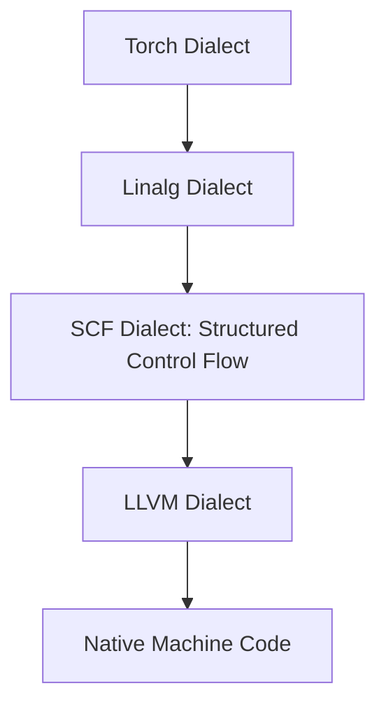

# Onboarding: What is MLIR?

> **Module 1**: A foundational overview of the Multi-Level Intermediate Representation (MLIR) compiler framework and its Linalg dialect.

---

## 1. The Core Compiler Concept

A compiler translates high-level human-readable code (like PyTorch or C++) into low-level machine-executable instructions (like x86 assembly or ARM machine code). To do this efficiently, it uses an **Intermediate Representation (IR)**.

Historically, compilers like **LLVM** used a single, flat, low-level IR. While this worked well for register allocation and instruction scheduling, it lost critical high-level structural information (such as nested loops, multi-dimensional array accesses, and tensor operations) before optimizations could occur.

```
[PyTorch / C++] ────► [Flat Low-Level IR] ────► [Machine Code]
                     (Loops flattened into branch/jump instructions)
                     (Optimizations like loop fusion are impossible)
```

**MLIR (Multi-Level Intermediate Representation)** solves this by supporting multiple layers of abstraction simultaneously. Instead of immediately lowering code to a low-level representation, MLIR represents operations at their natural level of abstraction and lowers them step-by-step.

---

## 2. The Dialect Architecture

In MLIR, a **Dialect** is a self-contained namespace that defines a set of operations, types, and attributes. Dialects can represent high-level graph structures (like PyTorch operators), mid-level loop nests (like Linalg or Affine), or low-level machine registers.

Our project relies on a pipeline that lowers code through several key dialects:



### Key Dialects Used in This Project

1. **`func`**: Defines functions, calls, and returns.
2. **`tensor`**: Represents high-level, immutable multi-dimensional arrays (like PyTorch tensors).
3. **`linalg`**: Represents linear algebra operations and structured loop nests. This is the **primary target** for our RL agent.
4. **`scf` (Structured Control Flow)**: Represents structured loops (`scf.for`) and conditionals (`scf.if`).
5. **`memref`**: Represents allocated, mutable memory buffers.
6. **`arith`**: Represents standard arithmetic operations (add, multiply, compare).

---

## 3. Deep Dive: The Linalg Dialect

The **Linalg (Linear Algebra) Dialect** is uniquely suited for compiler optimization because it represents computations in a structured way that preserves loop nest semantics without rendering loops explicitly as branch instructions.

Linalg operations are divided into two main categories:
1. **Named Operations**: Common operations with predefined semantics (e.g., `linalg.matmul`, `linalg.conv_2d_nhwc_hwcf`, `linalg.batch_matmul`).
2. **Generic Operations (`linalg.generic`)**: A universal representation that can express almost any loop nest.

### Structural Elements of `linalg.generic`

A generic operation is characterized by:
- **Inputs and Outputs**: The input tensors (`ins`) and the output/destination buffer tensors (`outs`).
- **Iterator Types**: An array specifying the nature of each loop dimension. Dimensions can be:
  - `parallel`: Loop iterations have no dependencies and can run in any order.
  - `reduction`: Loop iterations compute a cumulative sum/product and must be combined.
  - `window`: Loop iterations represent stencil/sliding window offsets (e.g., in convolutions).
- **Indexing Maps**: A list of affine maps showing how the multidimensional indices of the loop nest map to the elements of each operand tensor.
- **Computation Block**: The actual scalar math performed at the innermost level of the loops.

> [!NOTE]
> The indexing maps and iterator types completely specify the geometry of the loop nest. This allows the compiler (and our RL agent) to manipulate loops (e.g., tile, fuse, interchange) mathematically, without needing to parse nested control flow loops manually.

---

## 4. Annotated Example: MLIR Loop Kernel

Here is an annotated, standalone MLIR benchmark from our dataset representing a matrix multiplication (`linalg.matmul`).

```mlir
// 1. Declare external function to get the current wall-clock time
func.func private @nanoTime() -> i64

// 2. The kernel containing the code to optimize
func.func @kernel(%arg0: tensor<128x256xf32>, %arg1: tensor<256x512xf32>, %arg2: tensor<128x512xf32>) -> tensor<128x512xf32> {
  
  // 3. A structured linalg.matmul operation tagged for the RL agent
  // {tag = "operation_000"} allows the agent to locate and reference this operation
  %0 = linalg.matmul {tag = "operation_000"}
    ins(%arg0, %arg1 : tensor<128x256xf32>, tensor<256x512xf32>)
    outs(%arg2 : tensor<128x512xf32>) -> tensor<128x512xf32>
    
  return %0 : tensor<128x512xf32>
}

// 5. The execution harness main function
func.func @main() -> (tensor<128x512xf32>, i64) {
  // Allocate tensors with dummy values
  %cst = arith.constant 1.0 : f32
  %t0 = tensor.empty() : tensor<128x256xf32>
  %t0_fill = linalg.fill ins(%cst : f32) outs(%t0 : tensor<128x256xf32>) -> tensor<128x256xf32>
  
  %t1 = tensor.empty() : tensor<256x512xf32>
  %t1_fill = linalg.fill ins(%cst : f32) outs(%t1 : tensor<256x512xf32>) -> tensor<256x512xf32>
  
  %t2 = tensor.empty() : tensor<128x512xf32>
  %t2_fill = linalg.fill ins(%cst : f32) outs(%t2 : tensor<128x512xf32>) -> tensor<128x512xf32>
  
  // Start timing
  %start = func.call @nanoTime() : () -> i64
  
  // Execute kernel
  %res = func.call @kernel(%t0_fill, %t1_fill, %t2_fill) : (tensor<128x256xf32>, tensor<256x512xf32>, tensor<128x512xf32>) -> tensor<128x512xf32>
  
  // Stop timing
  %end = func.call @nanoTime() : () -> i64
  
  // Calculate duration
  %time = arith.subi %end, %start : i64
  
  return %res, %time : tensor<128x512xf32>, i64
}
```

---

## 5. What "Scheduling" Means in MLIR

Rather than modifying code textually, modern MLIR compilation uses a **Transform Dialect**. A transformation schedule is a program that instructs the compiler to rewrite parts of the IR. 

Our RL agent outputs a schedule. For example:
- **Tiling**: Split loop dimensions into smaller blocks (e.g., loops of 128 split into blocks of 16 to fit into CPU L1/L2 caches).
- **Fusion**: Merge the loops of a producer operation directly into the loops of a consumer operation to avoid saving intermediate results back to main memory.
- **Interchange**: Reorder nested loops (e.g., swap loop `i` and loop `j`) so that the memory accesses match the cache layout (row-major memory access).
- **Vectorization**: Lower the innermost loop dimension into SIMD (Single Instruction Multiple Data) machine registers.
- **Parallelization**: Map independent outer loops to multiple threads (using OpenMP).

```
[RL Agent] ──► Output: Schedule (Transforms) ──► Apply Transforms on MLIR ──► Machine Code
```

In the next module, we will cover how to set up the environment and compile the LLVM project to run this code on an HPC cluster.
