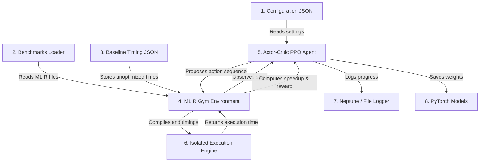

# Onboarding: Architecture Overview

> **Module 3**: A structural view of the MLIR-RL project directories, files, runtime components, and data flow.

---

## 1. High-Level Component Architecture

The project operates as a closed-loop system where a Reinforcement Learning (RL) agent interacts with a custom compiler environment. The environment takes schedules proposed by the agent, applies them, and measures the execution time to compute a reward.



---

## 2. Directory Structure Walkthrough

The workspace is organized into self-contained modules:

- **`rl_autoschedular/`**: Contains the reinforcement learning agents.
  - **`rl_autoschedular_v0/`**: Baseline (LSTM encoder, no hardware features, no shaped reward).
  - **`rl_autoschedular_v4_9/`**: Current state-of-the-art (Transformer encoder, process isolation, hardware-aware features, shaped reward disabled).
  - **`rl_autoschedular_paper/`**: Standard LSTM paper baseline (process isolation enabled).
  - **`rl_autoschedular_paper_transformer/`**: Standard Transformer paper baseline (process isolation enabled).
- **`data_utils/`**: Conversions and feature extraction scripts for compiling datasets.
- **`tools/`**: Native C++ tools that parse and check the MLIR code during dataset creation.
  - `ast_dumper/`: Dumps consumer-producer dependency trees.
  - `vectorizer/`: Identifies loop dimensions eligible for SIMD vectorization.
- **`utils/`**: Common utilities used by all packages (e.g., config parser, custom logger).
- **`scripts/`**: Executables, scripts, and Slurm files used to train and evaluate agents.
- **`config/`**: JSON configuration profiles grouped by dataset family.
- **`data/`**: Storage folder for the MLIR training and test files.
- **`results/`**: Execution outputs, checkpoints, and performance logs.

---

## 3. Results Directory Layout

Our system uses an organized layout under `results/` for experiment tracking and easy comparison in the dashboard. Each training run creates a new incremented directory `run_N` (e.g., `run_0`, `run_1`):

```
results/<experiment_name>/<agent_dir>/run_N/
├── train/
│   ├── results.json               # Cumulative rewards, speedups, execution times
│   └── checkpoint_100.json        # Training snapshot at iteration 100
├── eval/
│   └── checkpoint_100.json        # Evaluation speedups per checkpoint
├── models/
│   └── model_50.pt                # Checkpoint weights saved every 50 iterations
└── logs/
    ├── exec_data.json             # Cache mapping: schedule_hash -> execution_time_ns
    ├── tags                       # Run tags for indexing
    ├── train/                     # Event files (entropy, rewards, terminal speedups)
    └── eval/                      # Event files (evaluation metrics)
```

### The Execution Cache (`exec_data.json`)
Compiling and JIT-running MLIR code is the slowest part of training. To speed up training, `execute.py` caches execution times. If the agent generates a schedule for a benchmark that matches a previously compiled schedule, the system skips compiling and pulls the execution time directly from `exec_data.json`.

---

## 4. Shared Baseline File Resolution

To ensure different agents (e.g., V0 vs V4.9) evaluate on the exact same benchmarks and baseline execution times, the dataset timings are stored in shared JSON files:

- **`results/<experiment>/exec_times/base_train.json`**: Timing values for unoptimized MLIR training files.
- **`results/<experiment>/exec_times/base_eval.json`**: Timing values for unoptimized MLIR evaluation files.

The configuration reader maps these files dynamically. If `"json_file"` is left empty in the configuration JSON, the loader auto-derives the paths based on the active `"results_dir"`.

---

## 5. Main Control Loops: Training vs Standalone Evaluation

### Training (`train.sh`)
```
[Select Config] ──► [Load Benchmarks] ──► [Training Loop] ──► [Periodic Checkpoints]
                                               │
                                               └──► (Periodically run validation set
                                                     to monitor convergence)
```
- Submitted via Slurm (`scripts/train/train.sh`).
- Explores compilation configurations and optimizes PPO parameters.
- Periodically runs lightweight validation checks (in-training validation) and logs them.

### Standalone Evaluation (`eval.sh`)
```
[Select Checkpoint] ──► [Load base_eval.json] ──► [Run Deterministic Inference] ──► [Save Results]
```
- Submitted via Slurm (`scripts/eval/eval.sh`).
- Evaluates specific saved checkpoints (`model_N.pt`) deterministically (with no action exploration noise).
- Runs across all test benchmarks in `base_eval.json`.
- Results are saved under `eval/` and are consumed by the comparison dashboard.

In the next module, we will perform a deep dive into the RL agent's inner workings.
