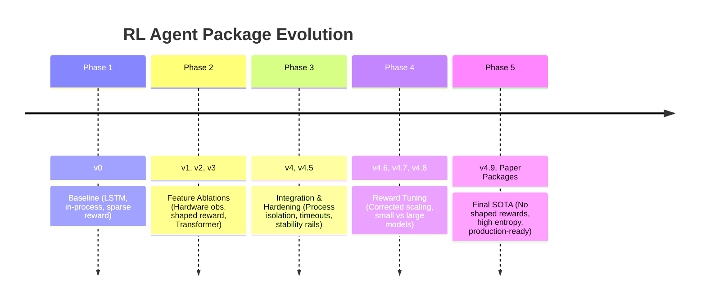

# Onboarding: Agent Versions & Evolution

> **Module 5**: Tracking the development history of the RL agent packages and understanding the differences between versions.

---

## 1. Version Comparison Matrix

The project contains multiple implementations under `rl_autoschedular/`. Each version is implemented as a **fully independent standalone package** to prevent dependency conflicts (e.g. `rl_autoschedular_v0`, `rl_autoschedular_v4_9`, etc.).

| Package Version | Encoder | HW Features | Shaped Reward | Execution Mode | Status / Purpose |
|---|---|:---:|:---:|---|---|
| **`rl_autoschedular_v0`** | LSTM | ❌ | ❌ | In-Process | Original baseline baseline |
| **`rl_autoschedular_v1`** | LSTM | ✅ | ❌ | In-Process | Hardware features ablation |
| **`rl_autoschedular_v2`** | LSTM | ❌ | ✅ | In-Process | Legacy reward-shaping prototype |
| **`rl_autoschedular_v2_5`** | LSTM | ❌ | ✅ | Isolated Subprocess | Hardened V2 (fair baseline) |
| **`rl_autoschedular_v3`** | Transformer | ❌ | ❌ | In-Process | Transformer representation ablation |
| **`rl_autoschedular_v4`** | Transformer | ✅ | ✅ | In-Process | Legacy combined model (high failure rate) |
| **`rl_autoschedular_v4_5`** | Transformer | ✅ | ✅ | Isolated Subprocess | Hardened reliability framework |
| **`rl_autoschedular_v4_6` / `v4_8`** | Transformer | ✅ | ✅ (Scale=0.05) | Isolated Subprocess | Corrected scale reward experiments |
| **`rl_autoschedular_v4_7`** | Transformer (small) | ✅ | ✅ (Scale=0.05) | Isolated Subprocess | Lightweight transformer exploration |
| **`rl_autoschedular_v4_9`** | Transformer | ✅ | ❌ (Hardcoded 0) | Isolated Subprocess | SOTA package (entropy collapse fix) |
| **`rl_autoschedular_paper`** | LSTM | ❌ | ❌ | Isolated Subprocess | Final paper LSTM baseline |
| **`rl_autoschedular_paper_transformer`** | Transformer | ❌ | ❌ | Isolated Subprocess | Final paper Transformer baseline |

---

## 2. Key Evolutionary Phases

### Phase 1: The Baseline (`v0`)
- Simple bidrectional LSTM encoder processing flat vectors of loops and memory bounds.
- All JIT-compilations ran inside the parent Python thread. If a compilation crashed with a compiler-level assertion, the entire training process died immediately.
- Explored loop transformations but struggled to generalize across complex multi-op loops.

### Phase 2: Feature Ablations (`v1`, `v2`, `v3`)
- Individual modifications to prove scientific hypotheses:
  - **`v1`**: Added hardware feature detectors to observation vectors.
  - **`v2`**: Introduced intermediate dense rewards based on arithmetic intensity and loop properties.
  - **`v3`**: Replaced LSTM with a Transformer encoder, representing nested loops as sequences of tokens.

### Phase 3: The Integration Failure and Hardening (`v4`, `v4_5`)
- **`v4`** combined all features. However, the agent learned to exploit the dense shaped rewards, choosing illegal combinations of tiling and fusion that repeatedly crashed the compiler. Training failure rates reached **~50%**.
- **`v4_5`** rewrote the execution boundaries. It implemented **Process Isolation** (compilation and timing tasks run in a child subprocess), **Dynamic Timeouts** (benchmarks capped at $5\times$ baseline execution time), and **Success-Contingent Reward Negation** (negating shaped rewards if code execution failed).

### Phase 4: Scaling and Hyperparameter Tuning (`v4_6` – `v4_8`)
- Corrected shaped reward scaling: in V4.5, shaped rewards were $20\times$ larger than terminal speedups. V4.6 scaled shaped rewards down to $10\%$ of terminal reward magnitude.
- **`v4_7`** introduced a smaller, faster Transformer model (3.6x fewer parameters). It peaked early but deteriorated, indicating that compiler loop optimizations require large representation capacity (e.g. $d_{\text{model}} \ge 256$).
- Added optimizer state checkpointing to allow clean resume-from-timeout on HPC clusters.

### Phase 5: The Shaped Reward Rebuttal (`v4_9` & Paper Packages)
- **Entropy Collapse Discovery**: In late iterations of V4.6–V4.8 training runs, the policy entropy plummeted to 0, causing the policy to freeze and produce identical actions. The combination of Transformer encoders and dense shaped rewards forced the agent to exploit static heuristics (like loop vectorizability indicators) rather than wall-clock times.
- **`v4_9`** hardcoded the shaped reward function to return `0.0`. This successfully prevented entropy collapse, outperforming all shaped reward variants.
- **Paper Packages**: Standalone clean versions built for publication. They port all V4.9 safety features (subprocess execution, SIGABRT signal catching, dataset guards) to cleanly compare an LSTM encoder (`paper`) with a Transformer encoder (`paper_transformer`).

---

## 3. Which Package Should You Use?

> [!IMPORTANT]
> If you are setting up new training runs or extending the autoscheduler:
>
> 1. **Do NOT use `v1`, `v2`, `v3`, or `v4`**: These are legacy ablation codes without process isolation. They will crash on Slurm and pollute your logs.
> 2. **For production and testing**: Use **`rl_autoschedular_v4_9`** (if you want hardware-aware optimizations) or the **paper packages** (`rl_autoschedular_paper` or `rl_autoschedular_paper_transformer`).
> 3. **To run ablation studies**: Use the custom ablation wrappers under the `v4_5` implementation (e.g., `v45_no_hw`, `v45_no_transformer` configs).

In the next module, we will explore the supported action space transformations.
