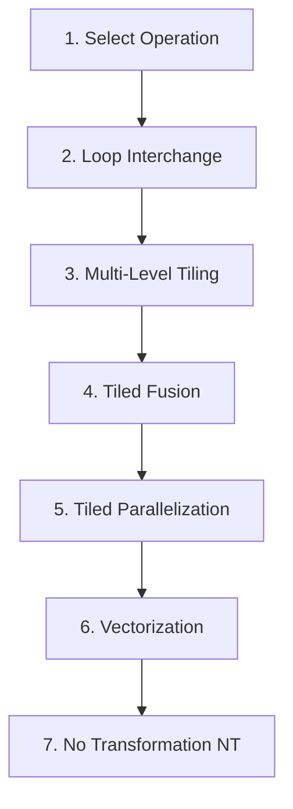

# Onboarding: Actions & Optimizations

> **Module 6**: Detailed breakdown of compiler loop transformations in our action space, analysis of missing loop nest optimizations (such as loop skewing, distribution, and peeling), and the resulting mathematical complexity.

---

## 1. Supported Action Space (Transformations)

The agent sequentially schedules each Linalg operation in the computational block. The supported actions are defined in the `rl_autoschedular_v4_9/actions/` package.

### A. Tiling (`tiling.py` — symbol: `T`)
- **Concept**: Partitions a large iteration space into smaller, multi-dimensional blocks (tiles).
- **Goal**: Maximizes cache reuse by ensuring data chunks loaded into L1/L2 caches are reused repeatedly before being evicted.
- **Example**:
  * *Before (1D Nest)*:
    ```c
    for (int i = 0; i < 1024; i++) { A[i] = B[i] + 1; }
    ```
  * *After (Tiled by 32)*:
    ```c
    for (int ic = 0; ic < 1024; ic += 32) {
      for (int i = ic; i < ic + 32; i++) { A[i] = B[i] + 1; }
    }
    ```
- **Agent mapping**: The agent selects discrete tile sizes ($1, 2, 4, 8, 16, 32, 64, 128, 256$, or "full" = no tiling) for each loop nest dimension.

### B. Tiled Fusion (`tiled_fusion.py` — symbol: `TPF`)
- **Concept**: Combines the loop nests of a producer operation and a consumer operation.
- **Goal**: Reduces memory bandwidth pressure. Intermediate values are consumed immediately at the register/L1 cache level instead of being written back to main memory (DRAM).
- **Example**:
  * *Before (Sequential)*:
    ```c
    // Loop 1
    for (int i = 0; i < 100; i++) { tmp[i] = A[i] * 2; }
    // Loop 2
    for (int i = 0; i < 100; i++) { B[i] = tmp[i] + 5; }
    ```
  * *After (Fused)*:
    ```c
    for (int i = 0; i < 100; i++) {
      tmp[i] = A[i] * 2;
      B[i] = tmp[i] + 5;
    }
    ```
- **Agent mapping**: Binary decision per producer-consumer operation pair. When selected, the compiler fuses the producer operation into the tiled loops of the consumer.

### C. Loop Interchange (`interchange.py` — symbol: `I`)
- **Concept**: Swaps the nesting order of loops (e.g., swapping loop `i` and `j`).
- **Goal**: Ensures stride-1 memory access patterns to align spatial locality with the cache line (typically 64 bytes).
- **Example**:
  * *Before (Row-Major access, Column-Major loop order - Cache Hostile)*:
    ```c
    for (int j = 0; j < 100; j++) {
      for (int i = 0; i < 100; i++) { A[i][j] = B[i][j] + 1; } // A is accessed with stride 100
    }
    ```
  * *After (Interchanged - Cache Friendly)*:
    ```c
    for (int i = 0; i < 100; i++) {
      for (int j = 0; j < 100; j++) { A[i][j] = B[i][j] + 1; } // Stride-1 sequential access
    }
    ```
- **Agent mapping**: Reorders loops. In "pointers" mode, it chooses indices to swap.

### D. Tiled Parallelization (`tiled_parallelization.py` — symbol: `TP`)
- **Concept**: Distributes loop iterations across multiple CPU thread workers.
- **Goal**: Leverages multi-core hardware platforms.
- **Example**:
  * *Before*: Standard single-threaded loops.
  * *After*: Annotating the outer loop with OpenMP directives (e.g., `#pragma omp parallel for`).
- **Agent mapping**: Binary selection on outer tiled loop dimensions to mark them as parallel execution targets.

### E. Vectorization (`vectorization.py` — symbol: `V`)
- **Concept**: Translates scalar operations in the innermost loop to execute concurrently using SIMD hardware.
- **Goal**: Multiplies instruction throughput by processing multiple data streams (e.g., 8 floats on AVX-256) per clock cycle.
- **Agent mapping**: Binary decision applied to the innermost loop, verified by the C++ `vectorizer` checker to ensure correctness.

---

## 2. Missing Loop Nest Optimizations

While our agent covers the primary loop optimizations, there are other classic "Loop Nest Optimizations" (often studied in polyhedral compilers) that are currently missing from the action space:

### A. Loop Skewing
- **Concept**: Applies an affine change of coordinates to loop iteration indices (e.g., replacing index `j` with `j' = i + j`).
- **Why it matters**: In loop nests with diagonal data dependencies (e.g., stencil codes or wavefront computations), loop iterations cannot be parallelized directly because of inter-loop dependencies. Loop skewing changes the shape of the iteration space, aligning dependencies along a single axis and exposing parallel loop dimensions.
- **Example**:
  * *Before (Diagonal Dependency, non-parallelizable loops)*:
    ```c
    for (int i = 1; i < N; i++) {
      for (int j = 1; j < M; j++) { A[i][j] = A[i-1][j] + A[i][j-1]; }
    }
    ```
  * *After (Skewed loop space, outer loop serial, inner loop parallel)*: Skewing exposes parallel execution across the wavefront diagonals.

### B. Loop Distribution (Fission)
- **Concept**: Splits a single loop containing multiple computations into multiple separate loops over the same index space.
- **Why it matters**: It reduces register pressure inside loop bodies. If a loop body has too many math operations, CPU registers spill to L1 cache. Splitting the loop lets each loop body fit completely in registers. It also enables vectorizing one part of a loop even if another part cannot be vectorized.
- **Example**:
  * *Before*:
    ```c
    for (int i = 0; i < N; i++) {
      A[i] = B[i] + C[i]; // Vectorizable
      D[i] = A[i-1] * E[i]; // Non-vectorizable dependency
    }
    ```
  * *After (Distributed)*:
    ```c
    for (int i = 0; i < N; i++) { A[i] = B[i] + C[i]; } // Can now be vectorized!
    for (int i = 0; i < N; i++) { D[i] = A[i-1] * E[i]; }
    ```

### C. Loop Peeling
- **Concept**: Extracts a small number of iterations (usually the first or last few) from a loop and executes them separately before or after the main loop.
- **Why it matters**: Peeling separates boundary conditions or unaligned memory access iterations (e.g., initial array offsets) from the main loop body. This allows the compiler to vectorize the main loop cleanly without complex conditional branches inside the hot path.

### D. Loop Reversal
- **Concept**: Reverses the direction of loop iteration bounds (e.g., changing `i++` to `i--`).
- **Why it matters**: Reversing the iteration order of one dimension changes data dependencies, which can enable loop fusion or loop interchange that would otherwise be illegal.

### E. Loop Shifting
- **Concept**: Shifts the execution of statements within a loop nest by offsets (software pipelining variant at the loop level).
- **Why it matters**: Shifts the iteration index of select instructions to eliminate loop-carried dependencies, converting sequential nests into parallel loops.

---

## 3. Why are Skewing, Distribution, and Peeling Missing?

Integrating these optimizations into our RL agent poses engineering and compiler-level challenges:

1. **Transform Dialect Support**: MLIR's transform dialect has mature support for tiling (`transform.structured.tile`), fusion (`transform.structured.fuse_into_containing_op`), interchange, and vectorization. Support for skewing and distribution at the high-level `Linalg` structured operation level is less mature and often requires dropping down to lower-level loops (like `scf.for` or `affine`), which strips the operation tags we use to track operations.
2. **Safety and Correctness Masking**: Loop skewing and distribution require complex dependency check passes (e.g., polyhedral dependence analysis) to verify if the transformation is valid. Without a robust static dependence checker, adding skewing or distribution to the action space would cause a massive spike in compile-time crashes and timeouts.
3. **Action Space Explosion**: Adding skewing (which requires choosing a skewing factor matrix) or distribution (choosing splitting statements) dramatically increases the policy output action size, slowing down training convergence.

---

## 4. Complexity & Selection Flow

To keep the agent's action selection robust and prevent invalid schedules, actions are selected in a strict order:



At each step, action masks dynamically prune invalid options (such as tiling to factors that do not divide the loop boundary or vectorizing non-eligible loop configurations), ensuring the agent converges on high-performance, correct assembly schedules.
