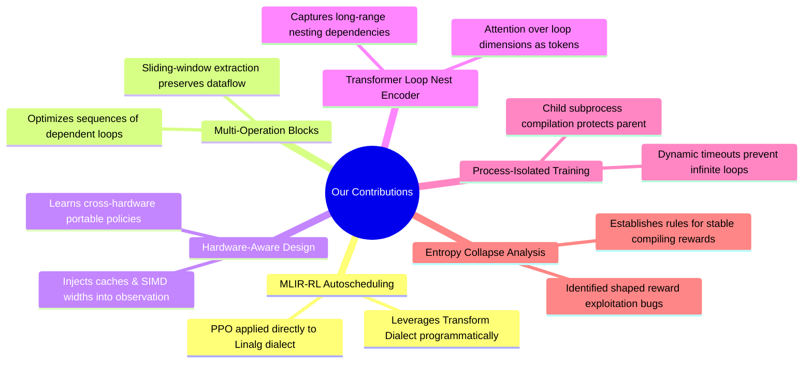

# Onboarding: Our Contributions & Novelties

> **Module 7**: Summary of the key scientific and engineering contributions of this project compared to existing compilers and literature.

---

## 1. Core Project Contributions

This project addresses key limitations in modern compiler optimization by applying Deep Reinforcement Learning directly to the MLIR ecosystem. 

---

## 2. Detailed Contribution Breakdown

### Contribution 1: PPO Auto-Scheduling on MLIR
- **State-of-the-Art Comparison**: Existing ML compilers like TVM (Ansor/AutoScheduler) rely on genetic algorithms or beam search to optimize schedule configurations. Other projects (like CompilerGym) apply RL, but only select high-level, compiler-wide passes (e.g. `O3` flag optimization).
- **Our Novelty**: We are among the first to apply Proximal Policy Optimization (PPO) directly to optimize structural loop nest transformations (Tiling, Interchange, Parallelization, Fusion, Vectorization) using MLIR’s programmatic Transform Dialect.

### Contribution 2: Multi-Operation Block Optimization
- **The Problem**: Optimizing single operations (like a single matrix multiplication) in isolation ignores the data dependency graph. A schedule that makes a matmul run fast might degrade the performance of a subsequent bias-add due to memory spillover.
- **Our Novelty**: We optimize **multi-operation blocks** (extracted via sliding dependency windows). The agent learns schedules that optimize the entire dataflow block concurrently, exploiting cross-operation caching through fusion.

### Contribution 3: Hardware-Aware Portability
- **The Problem**: Traditional compilers require manual autotuning (compiling and timing millions of permutations) when moving to a new processor architecture.
- **Our Novelty**: We inject the target CPU's L1/L2/L3 cache sizes, core counts, and SIMD width directly into the observation vector. The policy learns to generalize across hardware architectures (e.g., choosing different tiling factors for a 4-core AVX2 laptop vs a 64-core AVX-512 server).

### Contribution 4: Transformer-based Loop Nest Encoder
- **The Problem**: Compilers have traditionally represented loop nests as trees or flat vectors, which are processed sequentially by Recurrent Neural Networks (LSTMs). LSTMs struggle to preserve structural dependencies in deep nests.
- **Our Novelty**: We represent each loop level as a token in a sequence. Using Self-Attention, the Transformer model dynamically learns to relate outer loop bounds (relevant for tiling) to inner loop bounds (relevant for vectorization) simultaneously.

### Contribution 5: Process-Isolated Execution Infrastructure
- **The Problem**: Compiling unverified transformation schedules leads to compiler-level `SIGABRT` crashes and segmentation faults. During RL training, a single crash in the MLIR runtime would kill the Python training process.
- **Our Novelty**: We developed a robust compilation wrapper that isolates compiler runs in a child subprocess. It catches crashes gracefully, applies dynamic timeouts to prevent compiler hangs, and uses automatic command-line fallbacks (`mlir-cpu-runner`), enabling fully autonomous cluster training.

### Contribution 6: Reward Design and Entropy Collapse Investigation
- **Our Novelty**: We documented and solved the **Entropy Collapse** bug in loop-optimization environments. We proved that dense shaped rewards based on static heuristics (like vectorization indicators) mislead the agent into choosing invalid schedules that make the code run slower. Hardcoding intermediate rewards to zero forces the agent to optimize for real wall-clock performance, preserving policy exploration entropy.

In the next and final module, we will explore the data generation pipeline.
