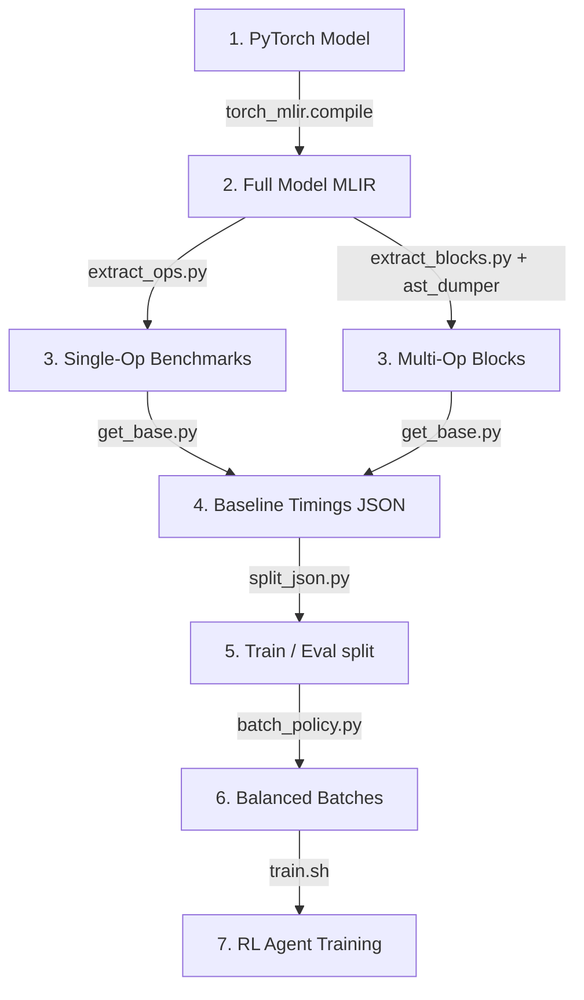

# Onboarding: Data Generation Pipeline

> **Module 8**: A step-by-step walkthrough of how raw PyTorch models are converted, extracted, timed, and split into MLIR-RL training datasets.

---

## 1. End-to-End Pipeline Flow

To train the RL agent, we convert neural network models into self-contained MLIR benchmark files. These files are timed to establish baselines, grouped into batches, and split into train and test sets.



---

## 2. Stage-by-Stage Breakdown

All pipeline scripts are located under `data_utils/`. The unified command line tool `data_utils/orchestrate.py` chains these stages together.

### Stage 1: Model Conversion (`convert/`)
- **Scripts**: `vision2mlir.py` (converts torchvision models like ResNet, VGG, MobileNet) and `nlp2mlir.py` (converts HuggingFace transformer models).
- **Process**: 
  1. Load the PyTorch `torch.nn.Module`.
  2. Run `torch.export` with dummy inputs to trace the computational graph.
  3. Compile the traced graph to MLIR Linalg dialect using `torch_mlir.compile()` with `OutputType.LINALG_ON_TENSORS`.
- **Output**: A raw MLIR file (`{model}_linalg.mlir`) containing the entire neural network structure.

### Stage 2: Operation and Block Extraction (`extract/`)
- **Single Operation Extraction (`extract_ops.py`)**:
  - Parses the raw MLIR file to locate all Linalg operations.
  - Extracts each operation and wraps it in a standalone MLIR benchmark module.
  - **Metadata Extraction**: Extracts properties like loop iteration types, input/output tensor shapes, and indexing maps, which are cached for the RL agent.
- **Multi-Operation Block Extraction (`extract_blocks.py`)**:
  - Uses the C++ **`ast_dumper`** tool to generate a JSON representation of the model's operation dependency graph.
  - Identifies paths of dependent operations.
  - Extracts sliding windows of operations (configured via `--window N --stride S`).
  - Skips trivial operations, keeping only windows that contain heavy workloads (convolutions, matrix multiplications, etc.).

### Stage 3: The Standalone Timing Harness
Every extracted benchmark file (ops or blocks) must contain a timing harness to allow compilation and execution during timing:

1. **`{tag = "operation_NNN"}`**: Added to each Linalg operation to let the RL agent target it.
2. **`@nanoTime()`**: Declared as an external function to measure execution time.
3. **Parameter-Pass Inputs**: Tensors are passed as function arguments rather than static constants, allowing the compiler to allocate them.
4. **`@main` Entry Function**: Allocates dummy input tensors, calls the kernel containing the operations, times the run, and returns both the computed output tensor and the duration in nanoseconds.

### Stage 4: Baseline timing (`scripts/baseline/get_base.py`)
- Before training, we must measure the unoptimized execution time for each benchmark.
- The script compiles and executes each benchmark 5 times using `mlir-cpu-runner` (via a subprocess to catch crashes) and takes the median execution time.
- **Output**: A JSON file containing mappings of `{benchmark_filename: baseline_duration_ns}`.

### Stage 5: Train/Eval Splitting (`scripts/data/split_json.py`)
- Splits the benchmark files and baseline timing JSONs.
- **Split Ratio**: Defaults to a stratified 80% train and 20% evaluation split.
- **Output**: Outputs `base_train.json` and `base_eval.json` under `results/<experiment>/exec_times/`.

---

## 3. Batch Policy Grouping (`batch_policy.py`)

During RL training, the agent compiles and runs groups of benchmarks (batches) at each step. 
- **The Problem**: If a batch contains both a fast element-wise addition (takes $10\mu s$) and a slow convolution (takes $500ms$), training stalls waiting for the slow convolution to compile and execute.
- **The Solution**: `batch_policy.py` fits a simple heuristic model on operation counts and tensor shapes to estimate benchmark complexity. It groups benchmarks of similar sizes into balanced batches, ensuring uniform batch execution times.

---

## 4. Pipeline Quick-Start Commands

You can run the entire pipeline end-to-end using `orchestrate.py`:

```bash
# 1. Convert ResNet18 to MLIR Linalg dialect
python data_utils/orchestrate.py convert --model resnet18 --output-dir data/resnet_raw/

# 2. Extract multi-op blocks (window size 5, stride 3)
python data_utils/orchestrate.py extract-blocks \
  --input data/resnet_raw/resnet18_linalg.mlir \
  --output-dir data/resnet_blocks/ \
  --window 5 --stride 3

# 3. Generate baseline timings
python scripts/baseline/get_base.py \
  --benchmarks-dir data/resnet_blocks/ \
  --output results/resnet_exp/exec_times/base.json

# 4. Split into train/eval sets
python scripts/data/split_json.py \
  --config config/new_dataset/train/v4_9_large.json
```

This completes the onboarding documentation suite. Refer back to these modules as you begin compiling and optimizing with the MLIR-RL framework!
