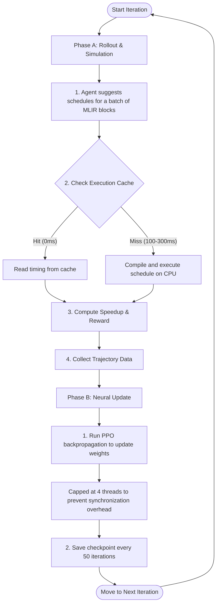

# MLIR-RL Comprehensive Training Manual

This document serves as the complete guide to training reinforcement learning auto-schedulers for MLIR loop nests. It is divided into three parts:
* **Part 1: DRL Fundamentals & Codebase Architecture** (Theoretical concepts and custom classes)
* **Part 2: Simulation vs. Optimization Mechanics** (How JIT, parallel rollouts, and PyTorch co-exist)
* **Part 3: Practical Setup & Pipeline Operations** (Config files, SLURM commands, and troubleshooting)

---

# Part 1: DRL Fundamentals & Codebase Architecture

In this project, Deep Reinforcement Learning (DRL) is used to automatically find the fastest loop nest schedules (such as loop tiling, loop interchange, and vectorization) for MLIR operations.

## 1. DRL Fundamentals
At each time step $t$ during compilation scheduling:
1. The agent observes the current state $s_t$ (the structural features of the current MLIR operation).
2. It chooses a scheduling action $a_t$ based on its strategy (policy).
3. The environment transitions to a new state $s_{t+1}$ (the code with the transformations applied).
4. The agent receives a reward $r_t$ reflecting execution speedup.

We use **Actor-Critic (specifically Proximal Policy Optimization - PPO)**:
* **Actor (Policy)**: Outputs action probabilities given a state.
* **Critic (Value)**: Predicts the expected log-speedup from the current state.
* **Clips updates** to prevent large, destructive policy changes.

## 2. Codebase Representation

### State & Observation
The agent schedules code **one operation at a time**:
* **State (`OperationState`)**: Holds the current MLIR module, active operation index, dataflow producer pointers, and sequence of applied transformations.
* **Observation (`Observation`)**: A tensor representation of the code, encoding features like loop bounds, memory access matrices, and action history.

### Action Space (`rl_autoschedular/actions/`)
The agent chooses from a **Hierarchical Action Space**:
1. `Tiling`: Break loops into nested blocks.
2. `TiledParallelization`: Parallelize outer loops.
3. `TiledFusion`: Tile and merge with a producer to improve cache locality.
4. `Interchange`: Swap loop nest ordering.
5. `Vectorization`: Generate SIMD instructions.
6. `NoTransformation`: Finalize operation and advance.

### Reward Function (`env.py`)
Rewards are based on JIT execution times:
$$\text{Reward} = \log_{10}\left(\frac{\text{Baseline execution time}}{\text{Optimized execution time}}\right)$$
* Compilations that fail or time out yield a severe penalty (e.g., `-20.0`).

### Model Architecture (`model.py`)
* **Encoder**: Parses loop nest features and embeds them (e.g., using LSTMs or Self-Attention Transformers).
* **Actor (`PolicyModel`)**: Predicts probability distributions over the 6 action classes and their parameters (e.g. tile sizes).
* **Critic (`ValueModel`)**: Predicts the log-speedup of the current state.

---

# Part 2: Simulation vs. Optimization Mechanics

The training script (`train.py`) executes a sequential loop that alternates between two distinct phases:



## 1. Phase A: Rollout & Simulation (Trajectory Collection)
During this phase, we interact with the environment to collect training data.

### Step 1: Evaluating Cache Hits and Misses
To train the agent, we must compile and execute the suggested loop nests on a CPU node:
1. Translate MLIR code to LLVM IR.
2. JIT-compile and execute the binary on the CPU node.
3. Measure execution runtime in nanoseconds (**100–300ms** per compile).
* **Execution Cache (`exec_data.json`)**: If a suggested schedule matches a previously run schedule, its runtime is fetched instantly from the cache (**0ms**).
* **Cache Miss Parallelism**: When multiple cache misses occur in a batch, the rollouts compile and execute them in parallel using a local `ThreadPoolExecutor` fallback scaled by `SLURM_CPUS_PER_TASK` to optimize throughput.

## 2. Phase B: Neural Network Weight Updates
Once a trajectory batch (e.g., 64 steps) is collected, JIT simulation stops, and PyTorch updates the networks.

### PPO Backpropagation & Thread Capping
* **Thread Cap**: In `train.py`, we restrict PyTorch to **4 threads**:
  ```python
  torch.set_num_threads(4)
  ```
* **The Reason**: Because our policy networks are lightweight (under 20MB), distributing their tensor updates across many cores yields heavy synchronization overhead. Capping PyTorch to **4 cores** isolates calculations, maximizing backpropagation throughput.

---

# Part 3: Practical Setup & Pipeline Operations

## 1. Setup & Environment
Ensure your interactive shell is configured before running custom scripts directly:
```bash
source ~/envs/mlir/bin/activate
set -a && source .env && set +a
```

## 2. Config Files
Each implementation package uses a configuration template under `config/`:

| Config File Path | Implementation Package | Primary Features |
|---|---|---|
| `config/<dataset>/train/v0.json` | `rl_autoschedular_v0` | LSTM encoder, sparse reward |
| `config/<dataset>/train/v1.json` | `rl_autoschedular_v1` | Hardware-aware observations (cache size, cores) |
| `config/<dataset>/train/v2.json` | `rl_autoschedular_v2` | Shaped rewards (parallelism, vectorization) |
| `config/<dataset>/train/v3.json` | `rl_autoschedular_v3` | Transformer loop nest encoder |
| `config/<dataset>/train/v4_5.json` | `rl_autoschedular_v4_5` | Extended action space, process-isolated, robust timeout |
| `config/<dataset>/train/v4_9.json` | `rl_autoschedular_v4_9` | v4.5 without shaped rewards (entropy collapse fix) |
| `config/paper/single_ops_dataset/paper_original_train.json` | `rl_autoschedular_paper` | Paper LSTM baseline, no HW, no shaped reward |
| `config/paper/single_ops_dataset/paper_transformer_small_train.json` | `rl_autoschedular_paper_transformer` | Paper Transformer baseline, small d_model |

> [!NOTE]
> Config files no longer require `json_file` or `eval_json_file` parameters; they are auto-derived from the results directory if omitted.

## 3. Directory Layout
Output results are written structured as:
```
results/<experiment>/<agent_dir>/
├── run_0/
│   ├── models/
│   │   ├── model_50.pt
│   │   └── model_100.pt
│   ├── logs/
│   │   ├── train/
│   │   ├── eval/
│   │   └── exec_data.json      # Cache of JIT timing results
│   └── train/
│       └── results.json        # Cumulative training performance
```

## 4. Operational Commands

### Launching Training via Slurm
All training scripts auto-resume from the last checkpoint if model checkpoints exist in their `models/` folder.
```bash
# Submit fresh or auto-resuming training job
sbatch scripts/train/train.sh config/ops_and_blocks/train/paper_original.json

# Resume training from a specific run directory
sbatch scripts/train/train.sh config/ops_and_blocks/train/paper_original.json \
  --resume results/ops_and_blocks_results/paper_original_agent/run_0
```

### Launching Evaluation via Slurm
```bash
# Evaluate checkpoints 100 to 1000 in sequence
sbatch scripts/eval/eval_batch.sh config/ops_and_blocks/eval/paper_original_eval.json 100 1000 100
```

## 5. Single Benchmark Smoke Test (Sanity Check)
To test if a custom configuration or package runs end-to-end without waiting for a full dataset:
```bash
# 1. Create a tiny benchmark set
mkdir -p data/smoke/
cp data/all/resnet18_sz224_bs1_conv_0.mlir data/smoke/

# 2. Modify config keys
# Set: "benchmarks_folder_path" to "data/smoke", "nb_iterations" to 5
# 3. Generate baseline and run training
python scripts/baseline/get_base.py --config config/smoke.json
python scripts/data/split_json.py config/smoke.json
python scripts/train/train.py
```
